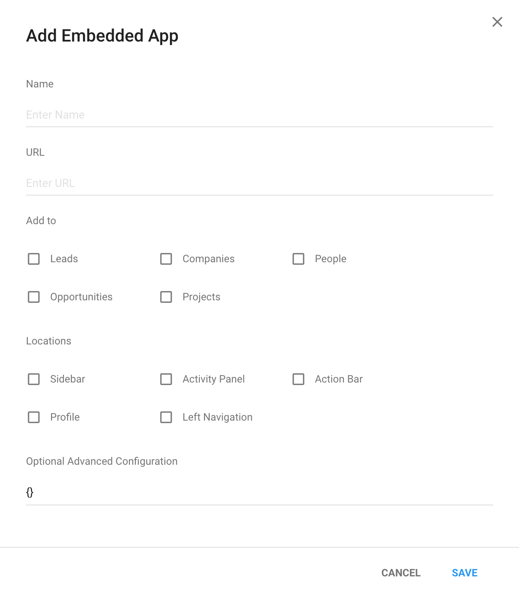

# Configuration

How to configure the embedded app: 
1. Add to
2. Locations
3. Optional Advanced Configuration



## Add to
Copper supports 5 entities where users can add an embedded app:
1. Leads
2. People
3. Companies
4. Opportunities
5. Projects

## Locations
Copper supports 5 locations where users can view the embedded app:
1. Sidebar
2. Activity Panel
3. Action Bar
4. Profile
5. Left Navigation

## Optional Advanced Configuration
#### html5Mode
The URL of a typical embedded app would be:
```
https://your-url.com/?location=sidebar&origin=...&instanceId=...
```

If a user specifies `html5Mode: true`, the URL will now become:
```
https://your-url.com/sidebar?origin=...&instanceId=...
```

#### refreshOnContextUpdate
By default, when switching to a new route in the Copper app, an event is sent to the embedded app. Users will now have the capability of using the following: 
```javascript
sdk.on('contextUpdated', function () {
  // here's your code to handle the event
})
```
Instead of handling the event, users also have an option to refresh the app by setting Optional Advanced Configuration as `refreshOnContextUpdate: true`. This will allow Copper to refresh every time the app changes route/context.

#### voip
By setting Optional Advanced Configuration: `voip: true`, all the phone numbers in Copper now becomes clickable. When users click on the phone number, they will be able to subscribe an event called `phoneNumberClicked`.
e.g.
```javascript
sdk.on('phoneNumberClicked', function ({ number }) {
  // do something with number
})
```

#### allowHttp
By default, Copper does not allow http url to be used in an embedded app. However, setting Optional Advanced Configuration `allowHttp: true` will allow users to embed http url into the embedded app. 

If the browser still blocks the user from seeing the http url, following the steps below would unblock the user: 
1. Click on the small icon in the user's browser's address bar on the right
2. Click on "allow run unsafe script"

#### verifyServer
This allows users to verify that their parent frame is actually Copper. Please see more details in
[Secure Example](./EXAMPLES.html#secure-example)
