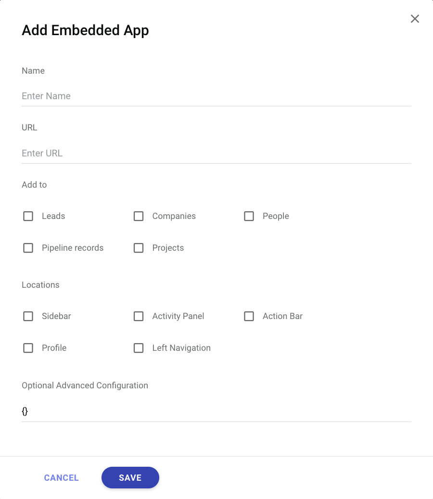

# 配置

如何配置嵌入式應用：
1. 添加至
2. 位置
3. 可選的進階配置



## 支援的實體
Copper 支援 5 種實體，使用者可以在這些實體中添加嵌入式應用：
1. 潛在客戶
2. 人員
3. 公司
4. 銷售管道記錄
5. 專案

## 支援的位置
Copper 支援 5 種位置，使用者可以在這些位置查看嵌入式應用：
1. 側邊欄
2. 活動面板
3. 操作列
4. 個人資料
5. 左側導航

## 可選的進階配置
### html5Mode
典型嵌入式應用的 URL 會是：
```
https://your-url.com/?location=sidebar&origin=...&instanceId=...
```

如果使用者指定 `html5Mode: true`，URL 將變為：
```
https://your-url.com/sidebar?origin=...&instanceId=...
```

### refreshOnContextUpdate
默認情況下，在 Copper 應用中切換到新路由時，會向嵌入式應用發送事件。使用者現在可以使用以下代碼：
```javascript
sdk.on('contextUpdated', function () {
  // 這裡是處理事件的代碼
})
```
除了處理事件外，使用者還可以通過將可選的進階配置設置為 `refreshOnContextUpdate: true` 來刷新嵌入式應用。每次應用變更路由/上下文時，嵌入式應用將會刷新。

### voip
通過設置可選的進階配置：`voip: true`，Copper 中的所有電話號碼現在變為可點擊。當使用者點擊電話號碼時，他們將能夠訂閱一個名為 `phoneNumberClicked` 的事件。
```javascript
sdk.on('phoneNumberClicked', function ({ number }) {
  // 對電話號碼進行處理
})
```

### allowHttp
默認情況下，Copper 不允許在嵌入式應用中使用 http URL。然而，設置可選的進階配置 `allowHttp: true` 將允許使用者將 http URL 嵌入到嵌入式應用中。

如果瀏覽器仍然阻止使用者查看 http URL，可以按照以下步驟解除阻擋：
1. 點擊瀏覽器地址欄右側的小圖標
2. 點擊「允許運行不安全的腳本」

### verifyServer
這允許使用者驗證他們的父幀實際上是 Copper。請參見更多細節：[安全範例](examples#安全範例)。